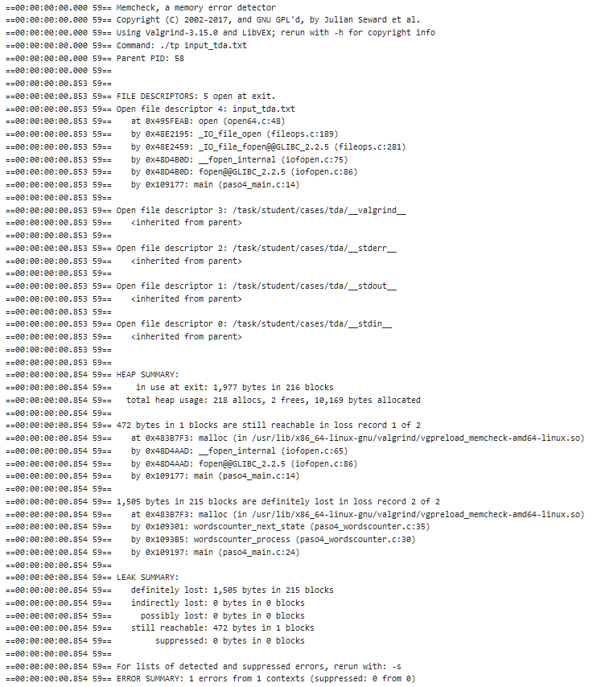
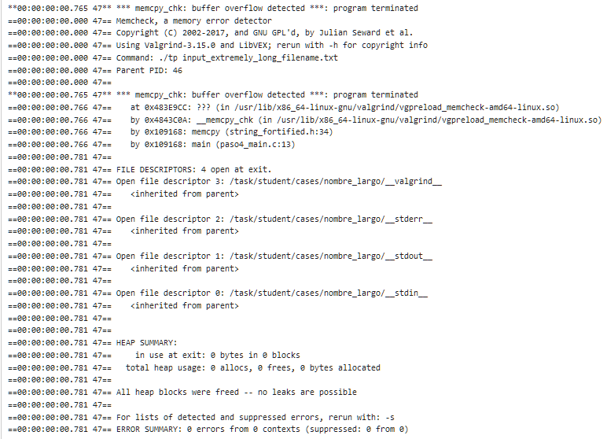
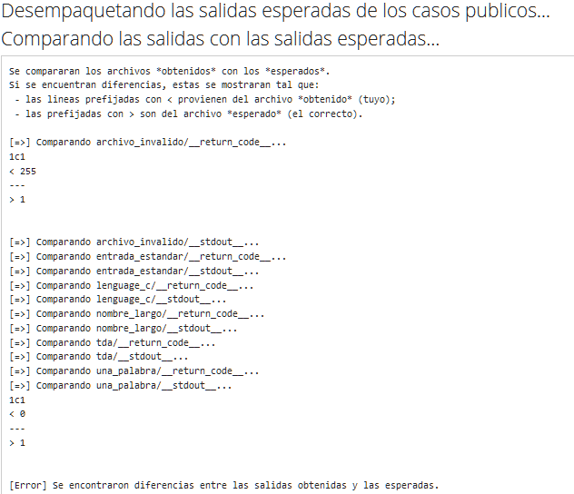
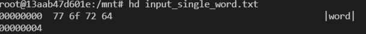
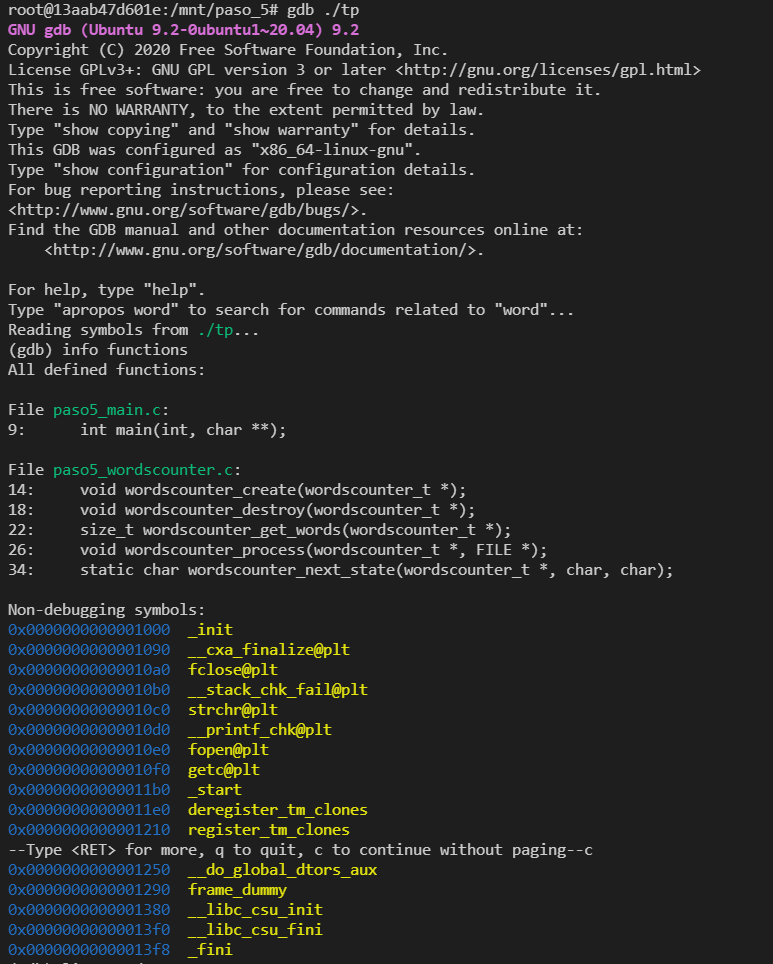
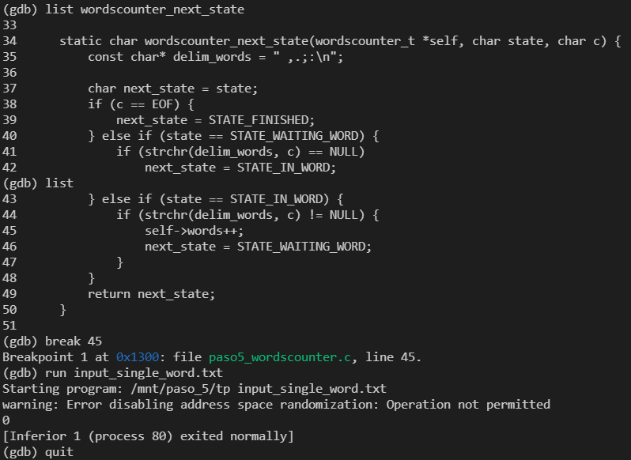
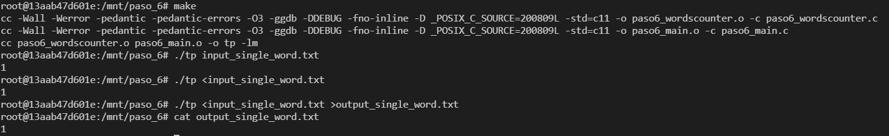
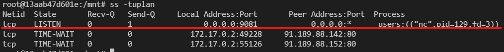
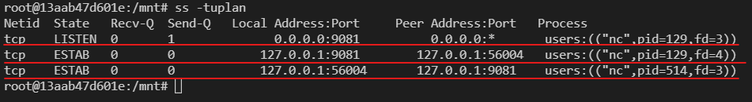

# Paso 0

### a) Capturas de pantalla de la ejecución del aplicativo
- Ejecución sin Valgrind: <br><br> 
    
- Ejecución con Valgrind: <br><br> 
    
### b) Valgrind
[Valgrind](https://www.valgrind.org) es un programa Open Source que contiene herramientas para debuggear y hacer análisis de rendimiento de un programa en c/c++.  
Es particularmente útil para detectar errores de memoria (con la herramienta memcheck).  
Entre las opciones más comunes se encuentran: `--tool`, con la que se elige entre las herramientas que ofrece el programa (Por defecto Memcheck), `--leak-check`, con la que se habilita o deshabilita el análisis detallado de las perdidas de memoria, y `--verbose` con la que se pide que el output contenga información más detallada que la que se ofrece por defecto. 
### c) sizeof()
`sizeof()` es una función que devuelve el tamaño en bytes de una variable o tipo de dato recibido como parámetro en la arquitectura y compilador utilizados.  
El valor de salida de `sizeof(char)` es 1 y el de `sizeof(int)` dependerá de la arquitectura y compilador utilizados (En mi caso, es de 4 bytes).
### d) sizeof(struct)
El *sizeof()* de un *struct* de c no es necesariamente igual a la suma de los *sizeof()* de cada uno de sus elementos. Esto se debe a que el compilador puede alinear los elementos en direcciones de memoria múltiplos de 4 para hacer que su acceso sea más rapido, a coste de utilizar más memoria.
Un ejemplo de este comportamiento se observa en el siguiente programa:
```c++
  #include <stdio.h>
  
  struct Ejemplo {
      int n;
      char a;
  };

  int main(void){
      struct Ejemplo ej = {1,'a'};
      int n = 1;
      char a = 'a';
      printf("sizeof() Struct: %ld\n",sizeof(ej));
      printf("sizeof() int + char : %ld\n",sizeof(n)+sizeof(a));
      return 0;
  }
```
cuya salida al ejecutarlo resulta:
```
  sizeof() struct: 8
  sizeof() int + char : 5
```
comprobando el comportamiento anteriormente mencionado.
### e) Archivos estándar
STDIN, STDOUT y STDERR son los canales de comunicación estandar al que tienen acceso los programas.
- STDIN es utilizado para la entrada de datos al programa
- STDOUT es utilizado para la salida de datos del programa
- STDERR es utilizado para la salida de mensajes de error del programa

Mediante el uso de los caracteres `>` y `<` puede *redirigirse* la salida de un programa hacia un archivo (`programa > archivo`), o la entrada de un programa desde un archivo (`programa < archivo`).  
Por otra parte, el caracter *pipe* `|` permite conectar la salida de un proceso directamente con la entrada de otro, sin recurrir a archivos intermedios. Por ejemplo: `programa1 | programa2` ejecutará y conectará la salida del `programa1` a la entrada del `programa2` y ejecutará este último.

# Paso 1

### a) Problemas de Estilo
Al subir el .zip al SERCOM se reciben los siguientes problemas de estilo:  
  
Analizando cada uno de los 11 errores reportados por orden de aparición, tenemos:
1) No se deja espacio entre el `while` y el `(`
2) Se deja un espacio entre `(` y la condición del if
3) Idem 2
4) Se puso un `else` en una nueva linea, en vez de a continuación del `}` que lo precede.
5) Idem 4
6) No se deja espacio entre el `if` y el `(`
7) Se deja un espacio entre la última palabra de la linea y el `;`
8) Se utiliza `strcpy` en vez de `snprintf`, cuando esta última permite delimitar la capacidad del buffer.
9) Idem 4
10) Idem 4
11) Se supera la longitud máxima de linea recomendada de 80 caracteres.

### b) Errores de generación del ejecutable
Se reciben también los siguientes errores:  
  
Todos se tratan de errores de *compilación* debidos a la no inclusión del archivo `paso1_wordscounter.h` en `paso1_main.c`:
- El primero se da porque no está definido el struct wordscounter_t
- Los otros 4 se dan porque no están declaradas las funciones `wordscounter_create`, `wordscounter_process`, `wordscounter_get_words` y `wordscounter_destroy`
  
### c) Warnings
En realidad, los últimos 4 errores del ítem anterior son warnings, pero como compilamos con el flag `-Werror`, entonces todos los Warnings son interpretados como errores.

# Paso 2

### a) Correcciones
Utilizando el comando diff se observa que, basicamente, se corrigieron los errores de estilo que se detectaron en el paso anterior,
y también los de compilación producidos por no haber incluido `paso1_wordscounter.h` en `paso1_main.c`.

### b) Verificación de normas de programación
Se comprueba que el cpplint ya no da errores:  


### c) Errores de generación del ejecutable
Por otra parte, hay nuevos errores de generación del ejecutable:  
  
Nuevamente se tratan de errores de compilación por falta de definicionesn aunque esta vez en los archivos `paso2_wordscounter.c` y `paso2_wordscounter.h`, 
que en este caso se solucionarían incluyendo los headers `stddef.h`, `stdio.h` y `stdlib.h` en los archivos correspondientes 
(tal como se explica detalladamente en los errores de compilación obtenidos)

# Paso 3

### a) Correcciones
Se agregan los *include* a los headers mencionados en los errores del paso anterior, con la excepción de `stddef.h` que se reemplaza 
por `string.h`, pero sirve igual porque contiene la definición de `size_t`, que es lo que generaba el error.

### b) Errores de generación del ejecutable
Los nuevos errores de generación del ejecutable son los siguientes:   
  
Aunque en este caso el error es uno solo, y se da porque la función declarada en `paso3_wordscounter.h`:  
`void wordscounter_destroy(wordscounter_t *self);`  
no fué definida nunca, y es utilizada en `paso3_main.c`, por lo que, esta vez, se trata de un error del *linker*.

# Paso 4

### a) Correcciones
Se define en `paso4_wordscounter.c` la función `wordscounter_destroy`, pero no hace nada.

### b) Valgrind Tda
Los mensajes de error recibidos del caso de prueba Tda con valgrind fueron:  
  
En este caso, el error principal es que se realiza un `fopen()` en `paso4_main.c` para abrir el archivo, pero nunca se cierra con `fclose()`. Luego, hay una perdida de memoria por hacer un `malloc()` sin su correspondiente `free()` en `paso4_wordscounter.c`.

### c) Valgrind Long Filename
Los mensajes de error recibidos del caso de prueba Long Filename con valgrind fueron:  
  
En este caso, el error es un `Buffer Overflow` en `paso4_main.c` en la llamada a la función `memcpy`, que hace que finalice la ejecución del programa.

### d) memcpy() o strncpy()
El problema del `memcpy()` en este caso no se solucionaría simplemente usando `strncpy()`, porque realmente el inconveniente está en querer copiar la totalidad del buffer de origen en el buffer de destino, en vez de limitarlo al tamaño del buffer de destino.

### e) Segmentation Fault y Buffer Overflow
- **Segmentation Fault**: Se da cuando se intenta acceder a direcciones de memoria a las que no se tiene acceso, o se intenta escribir en direcciones de memoria de solo lectura.
- **Buffer Overflow**: Se da cuando se intenta asignar a un buffer de memoria una cantidad de datos mayor que el tamaño del buffer, sobreescribiendo los datos adyacentes que pueda haber.

# Paso 5

### a) Correcciones
- Para resolver el problema del archivo que no se cerraba, se agregó el `fclose()` faltante.
- Para el problema del *Buffer Overflow*, se simplifica directamente abriendo `argv[1]` en vez de volcar su contenido en la variable `filepath` como intermediario.
- Para el problema de la perdida de memoria por el `malloc()` no liberado, se simplifica guardando los caracteres delimitadores en una variable estática, evitando directamente el `malloc`.

### b) Fallas Invalid File y Single Word
La salida de los casos de prueba del *Sercom* resultan:  
  
Donde se puede observar que el error en *archivo_invalido* está en el `__return_code__` , que es 255 en vez de 1, y el error en *una_palabra* está en el `__stdout__`, que debería ser 1, pero es 0.  
Estos errores se deben a que:
- **Invalid File**: Falla porque el mensaje de error se define como -1 en vez de 1 (lo que se espera). Finalmente como la salida que espera el SO es del tipo `uint8_t`, se interpreta al -1 como `256 - 1 = 255`.
- **Single Word**: Falla porque el último carácter del archivo `input_single_word.txt` no se encuentra entre los carácteres marcados como delimitadores en el código, por lo que no se detecta ninguna palabra, y se devuelve 0 en vez de 1.
  
### c) hexdump
Al ejecutar el comando `hexdump` o `hd` sobre el archivo `input_single_word.txt` se obtiene lo siguiente:  
  
Donde se observa que el último carácter del archivo es `64` en hexadecimal, es decir, la letra `d`.

### d) gdb
Se ejecuta `gdb` y los comandos indicados, obteniendo:  
  
  
Y los comandos utilizados, en orden de ejecución resultan:  
- `gdb ./tp` : Para iniciar `gdb` sobre el programa `tp`
- `info functions` : Para mostrar información sobre todas las funciones encontradas en el programa
- `list wordscounter_next_state` + `list` : Para mostrar la definición entera de la función `wordscounter_next_state` junto con los numeros de linea de cada linea que la compone en el programa.
- `break 45` : Para crear un *breakpoint* en la linea 45 del programa
- `run input_single_word.txt` : Para ejecutar el programa con `input_single_word.txt` como parámetro
- `quit` : para salir de `gdb`

La razón por la cual no se detiene la ejecución en el *breakpoint* creado en la linea 45 al ejecutar el comando `run input_single_word.txt` es que el programa no entra en la condición del *if* de la linea anterior, porque el caracter `d` no se encuentra en la lista de delimitadores definidos, que es justamente el motivo por el cual esta prueba falla.

# Paso 6

### a) Correcciones
- Se cambia el código de error `-1` por `1` en `paso6_main.c`
- Se cambia la variable estática `delim_words` con los posibles delimitadores de palabras por la constante `DELIM_WORDS` (y se reemplazan todas las apariciones por el nuevo nombre) en el archivo `paso6_wordscounter.c`
- Se agrega la condición de que si se alcanza el `EOF` (*End of File*) mientras se está recorriendo una palabra en la función `wordscounter_next_state()`, entonces se suma una palabra al contador de palabras y se declara al siguiente estado como finalizado, en el archivo `paso6_wordscounter.c`
Estas correcciones logran resolver los errores encontrados en el paso anterior.

### b) Entregas realizadas
Listado de entregas realizadas en Sercom:  


### c) Pruebas Locales
Se compila y se ejecutan las pruebas requeridas de forma local, obteniendo los siguientes resultados:  
  
Como se observa, todos los resultados son los esperados.

# Paso 8

### a) Netcat flags
- `-l`: Para ejecutar netcat en modo *listen* (por defecto es *client*). Se queda "escuchando"
- `-p`: Para indicar en qué puerto local debe trabajar
  
### b) ss
Se ejecuta el comando `ss -tuplan` y se obtiene: 
  
Con la linea que hace referencia al netcat en espera subrayada en rojo.

### c) Comunicación Netcat
Al escribir frases en la tercer consola (Donde se ejecutó `nc 127.0.0.1 9081`) y apretar `Enter`, se observa que en la primer consola (Donde se ejecutó `nc -l -p 9081`) aparecen las mismas frases, un instante después.

### d) ss parte 2
Al ejecutar de nuevo el comando `ss -tuplan`, seobserva lo siguiente:  
  
Todas las lineas hacen ahora referencia a netcats, aunque pareciera que la primera y la segunda corresponden al primero ( Con estado *LISTEN* y *ESTAB*), y la tercera al segundo (con estado *ESTAB*)

### e) Tiburoncin
En la consola en la que corre *tiburoncin* se puede observar la cantidad de bytes enviados desde un *netcat* a otro, y además, lo que parece ser un `hexdump` del mensaje en cuestión.
Se dice que *tiburoncin* es un *man in the middle* porque hace de intermediario en la comunicación del proceso A al proceso B capturando (y registrando) cada uno de los mensajes del cliente antes de dirigirlos al destinatario.

### f) Tiburoncin parte 2
Se muestra el contenido de uno de los archivos `.dump` que generó tiburoncin: 
- con `cat AtoB.dump` :  
  ```
  486f6c610a4d756e646f0a
  ```
- con `xxd -p -c 16 -r AtoB.dump | hexdump -C` : 
  ```
  00000000  48 6f 6c 61 0a 4d 75 6e  64 6f 0a                 |Hola.Mundo.|
  0000000b
  ```