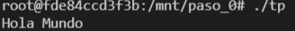
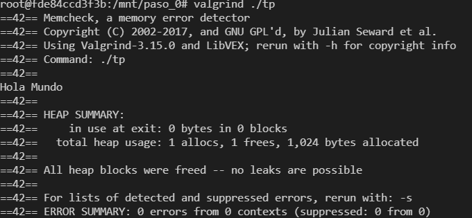
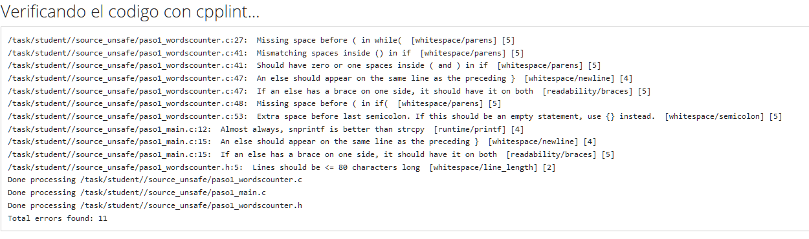
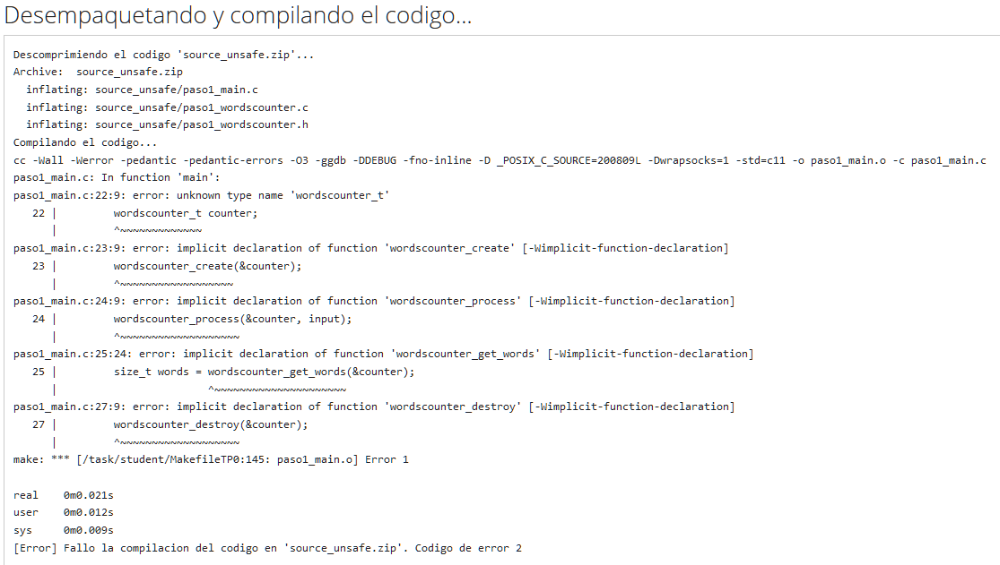
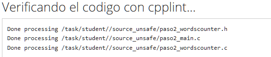
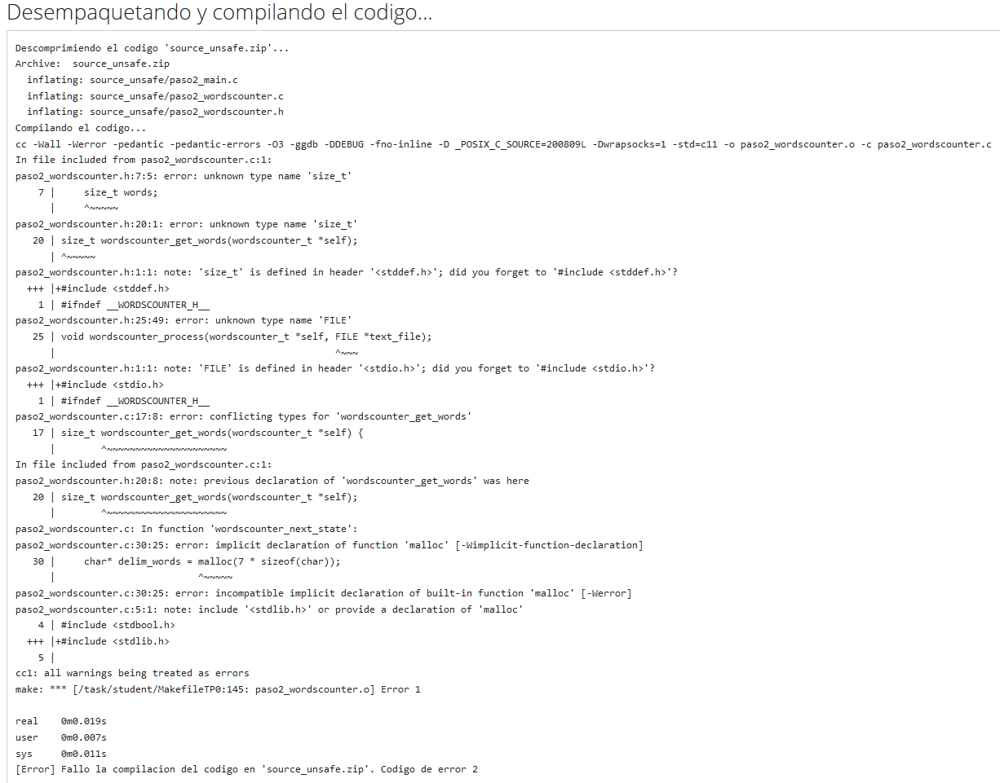
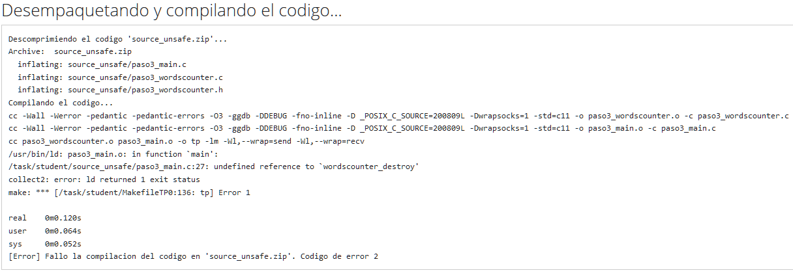

# Paso 0

### a) Capturas de pantalla de la ejecución del aplicativo
- Ejecución sin Valgrind: <br><br> 
    
- Ejecución con Valgrind: <br><br> 
    
### b) Valgrind
[Valgrind](https://www.valgrind.org) es un programa Open Source que contiene herramientas para debuggear y hacer análisis de rendimiento de un programa en c/c++.  
Es particularmente útil para detectar errores de memoria (con la herramienta memcheck).  
Entre las opciones más comunes se encuentran: `--tool`, con la que se elige entre las herramientas que ofrece el programa (Por defecto Memcheck), `--leak-check`, con la que se habilita o deshabilita el análisis detallado de las perdidas de memoria, y `--verbose` con la que se pide que el output contenga información más detallada que la que se ofrece por defecto. 
### c) sizeof()
`sizeof()` es una función que devuelve el tamaño en bytes de una variable o tipo de dato recibido como parámetro en la arquitectura y compilador utilizados.  
El valor de salida de `sizeof(char)` es 1 y el de `sizeof(int)` dependerá de la arquitectura y compilador utilizados (En mi caso, es de 4 bytes).
### d) sizeof(struct)
El *sizeof()* de un *struct* de c no es necesariamente igual a la suma de los *sizeof()* de cada uno de sus elementos. Esto se debe a que el compilador puede alinear los elementos en direcciones de memoria múltiplos de 4 para hacer que su acceso sea más rapido, a coste de utilizar más memoria.
Un ejemplo de este comportamiento se observa en el siguiente programa:
```c++
  #include <stdio.h>
  
  struct Ejemplo {
      int n;
      char a;
  };

  int main(void){
      struct Ejemplo ej = {1,'a'};
      int n = 1;
      char a = 'a';
      printf("sizeof() Struct: %ld\n",sizeof(ej));
      printf("sizeof() int + char : %ld\n",sizeof(n)+sizeof(a));
      return 0;
  }
```
cuya salida al ejecutarlo resulta:
```
  sizeof() struct: 8
  sizeof() int + char : 5
```
comprobando el comportamiento anteriormente mencionado.
### e) Archivos estándar
STDIN, STDOUT y STDERR son los canales de comunicación estandar al que tienen acceso los programas.
- STDIN es utilizado para la entrada de datos al programa
- STDOUT es utilizado para la salida de datos del programa
- STDERR es utilizado para la salida de mensajes de error del programa

Mediante el uso de los caracteres `>` y `<` puede *redirigirse* la salida de un programa hacia un archivo (`programa > archivo`), o la entrada de un programa desde un archivo (`programa < archivo`).  
Por otra parte, el caracter *pipe* `|` permite conectar la salida de un proceso directamente con la entrada de otro, sin recurrir a archivos intermedios. Por ejemplo: `programa1 | programa2` ejecutará y conectará la salida del `programa1` a la entrada del `programa2` y ejecutará este último.

# Paso 1

### a) Problemas de Estilo
Al subir el .zip al SERCOM se reciben los siguientes problemas de estilo:  
  
Analizando cada uno de los 11 errores reportados por orden de aparición, tenemos:
1) No se deja espacio entre el `while` y el `(`
2) Se deja un espacio entre `(` y la condición del if
3) Idem 2
4) Se puso un `else` en una nueva linea, en vez de a continuación del `}` que lo precede.
5) Idem 4
6) No se deja espacio entre el `if` y el `(`
7) Se deja un espacio entre la última palabra de la linea y el `;`
8) Se utiliza `strcpy` en vez de `snprintf`, cuando esta última permite delimitar la capacidad del buffer.
9) Idem 4
10) Idem 4
11) Se supera la longitud máxima de linea recomendada de 80 caracteres.

### b) Errores de generación del ejecutable
Se reciben también los siguientes errores:  
  
Todos se tratan de errores de *compilación* debidos a la no inclusión del archivo `paso1_wordscounter.h` en `paso1_main.c`:
- El primero se da porque no está definido el struct wordscounter_t
- Los otros 4 se dan porque no están declaradas las funciones `wordscounter_create`, `wordscounter_process`, `wordscounter_get_words` y `wordscounter_destroy`
  
### c) Warnings
En realidad, los últimos 4 errores del ítem anterior son warnings, pero como compilamos con el flag `-Werror`, entonces todos los Warnings son interpretados como errores.

# Paso 2

### a) Correcciones
Utilizando el comando diff se observa que, basicamente, se corrigieron los errores de estilo que se detectaron en el paso anterior,
y también los de compilación producidos por no haber incluido `paso1_wordscounter.h` en `paso1_main.c`.

### b) Verificación de normas de programación
Se comprueba que el cpplint ya no da errores:  


### c) Errores de generación del ejecutable
Por otra parte, hay nuevos errores de generación del ejecutable:  
  
Nuevamente se tratan de errores de compilación por falta de definicionesn aunque esta vez en los archivos `paso2_wordscounter.c` y `paso2_wordscounter.h`, 
que en este caso se solucionarían incluyendo los headers `stddef.h`, `stdio.h` y `stdlib.h` en los archivos correspondientes 
(tal como se explica detalladamente en los errores de compilación obtenidos)

# Paso 3

### a) Correcciones
Se agregan los *include* a los headers mencionados en los errores del paso anterior, con la excepción de `stddef.h` que se reemplaza 
por `string.h`, pero sirve igual porque contiene la definición de `size_t`, que es lo que generaba el error.

### b) Errores de generación del ejecutable
Los nuevos errores de generación del ejecutable son los siguientes:   
  
Aunque en este caso el error es uno solo, y se da porque la función declarada en `paso3_wordscounter.h`:  
`void wordscounter_destroy(wordscounter_t *self);`  
no fué definida nunca, y es utilizada en `paso3_main.c`, por lo que, esta vez, se trata de un error del *linker*.